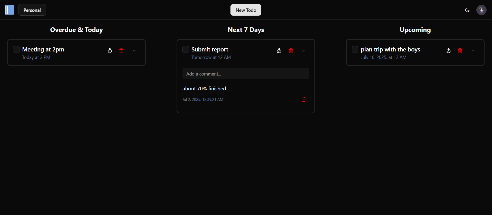

<h1 align="center">2DO.</h1>

---

## Features
1. **Effortless Task Management**: Easily create, edit, and delete your to-do items with an intuitive interface, ensuring your task list is always up-to-date.

2. **Personalized Workspaces**: Organize your tasks into dedicated personal workspaces, allowing you to categorize and focus on different projects or areas of your life without clutter.

3. **Collaborative Shareable Workspaces**: Share your workspaces with others to collaborate seamlessly on projects, delegate tasks, and track progress together in real-time.

4. **Interactive Drag-and-Drop Comments**: Enhance communication and task clarity with the ability to add and manage comments using a convenient drag-and-drop interface, making discussions more dynamic and organized.

5. **Streamlined Workflow**: Designed for efficiency, our app helps you manage your daily tasks and complex projects with ease, boosting your productivity.

6. **Real-time Synchronization**: All changes are synced in real-time across devices, so you always have the most current view of your tasks and collaborations.

7. **Lightning-Fast Responsiveness (Optimistic UI)**: Experience incredibly smooth and immediate interactions thanks to optimistic UI updates, making your app feel incredibly fast and responsive.

8. **Automatic Date Extraction**: Smartly identifies and extracts dates from your task titles, automatically setting due dates and reminders for you.

---

## Tech Stack

- Next.js
- Typescript
- Better-auth
- NeonDB
- DrizzleORM
- Shadcn/ui
- Framer motion
- hello-pangea/dnd

---

## Future work

- **Enhanced Real-time Collaboration with WebSockets**: We plan to integrate WebSockets to further enhance real-time capabilities, providing even more instantaneous updates and a smoother collaborative experience for shared workspaces.